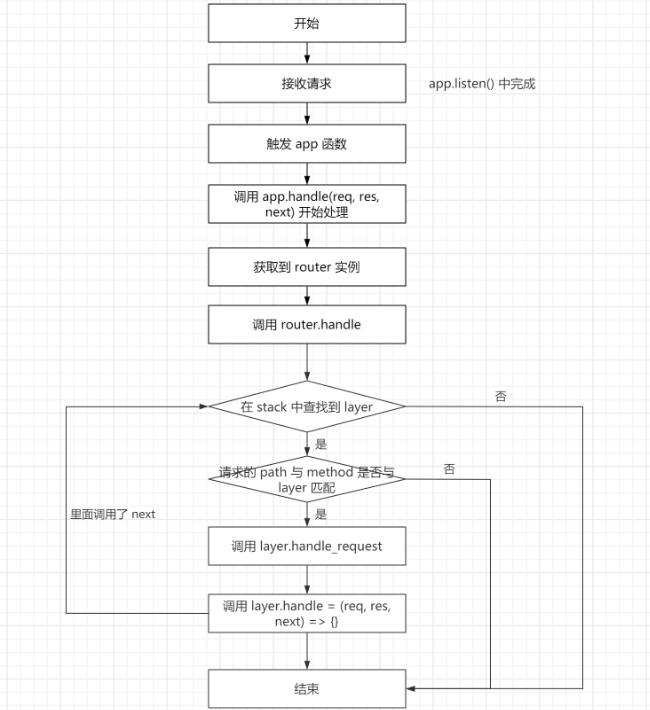

### 阅读 Express 源码

> version:4.18.1

```
Express
├── benchmarks                  基准相关 测试性能
├── examples                    案例代码
├── lib                         express 核心源码目录
│   ├── middleware              中间件相关
│   │   ├── init.js             将新增加在 req 和 res 的功能挂载到原始请求的 req 和 res 的原型上
│   │   └── query.js            将请求 url 中的 query 部分添加到 req.query
│   ├── router                  路由相关(核心)
│   │   ├── index.js            路由器的核心代码
│   │   ├── layer.js            路由器的层级路由
│   │   └── route.js            路由器的路由
│   ├── application.js          创建 express 应用后可直接调用的 api 均在此处（核心）
│   ├── express.js              创建 express 应用
│   ├── request.js              丰富了 http 中 request 实例的功能
│   ├── response.js             丰富了 http 中 response 实例的功能
│   ├── utils.js                一些辅助工具函数
│   ├── view.js                 封装了模板渲染引擎，通过 res.render() 调用引擎渲染网页
├── test                        单元测试
├── index.js                    require('express') 的入口
```

**基本流程**



**总结**

1. express 中间件的触发,主要就是外部访问,从所有存储的中间件 layer 的 stack 数组中找到匹配中间件 layer 执行
2. layer.handle_request_fn(req,res,next),实际上就是执行 layer.handle
3. 而以前就是把中间件函数挂载在 layer.handle 上,实际上就是执行中间件函数,并且把 next 当做参数穿进去
4. 当使用的时候调用了 next,继续去 stack 数组中查找下一匹配的中间件 layer,直到找到为止
5. 当找到为止,就是执行完所有的中间件函数,并且把请求转发到下一个中间件

**参考**

- [三步法解析 Express 源码](https://juejin.cn/post/6884575671721394189)
